# OTP Authentication - Quick Reference

## Database Schema

### DynamoDB: `restaurant-otp-codes-dev` Table

**Primary Key:** `email` (String)

| Attribute | Type | Description | Example |
|-----------|------|-------------|---------|
| `email` | String | User's email address | `user@example.com` |
| `otp` | String | 6-digit OTP code | `123456` |
| `userData` | Map | User registration data | `{name: "John", phone: "+1234"}` |
| `attempts` | Number | Failed verification attempts | `2` |
| `maxAttempts` | Number | Maximum allowed attempts | `5` |
| `createdAt` | String | ISO timestamp | `2024-02-19T10:30:00Z` |
| `ttl` | Number | Unix timestamp for auto-deletion | `1708345800` |

**TTL Configuration:**
- Attribute: `ttl`
- Enabled: Yes
- Records auto-delete 10 minutes after creation

### DynamoDB: `restaurant-api-users-dev` Table

| Attribute | Type | Description |
|-----------|------|-------------|
| `userId` | String (PK) | Cognito user sub |
| `email` | String | Email address |
| `firstName` | String | First name |
| `lastName` | String | Last name |
| `phone` | String | Phone number |
| `name` | String | Full name |
| `createdAt` | String | Creation timestamp |
| `updatedAt` | String | Last update timestamp |
| `registrationMethod` | String | `"otp"` for OTP signup |

## API Endpoints

### 1. Send OTP (`POST /auth/send-otp`)

**Purpose:** Send OTP code to user's email

**Request:**
```javascript
{
  "email": "user@example.com",  // Required
  "name": "John Doe",            // Required
  "phone": "+1234567890"         // Optional
}
```

**Success Response (200):**
```javascript
{
  "success": true,
  "message": "OTP sent to user@example.com",
  "data": {
    "email": "user@example.com",
    "expiryMinutes": 10
  }
}
```

**Error Responses:**
- `409`: Email already registered
- `400`: Invalid email format
- `500`: Failed to send email

**Curl Example:**
```bash
curl -X POST http://localhost:3000/auth/send-otp \
  -H "Content-Type: application/json" \
  -d '{
    "email": "user@example.com",
    "name": "John Doe",
    "phone": "+1234567890"
  }'
```

---

### 2. Verify OTP (`POST /auth/verify-otp`)

**Purpose:** Verify OTP and create Cognito account

**Request:**
```javascript
{
  "email": "user@example.com",  // Required
  "otp": "123456"               // 6-digit code
}
```

**Success Response (201):**
```javascript
{
  "success": true,
  "message": "Account created successfully. Please set your password.",
  "data": {
    "userId": "us-east-1_xxxxx-userid",
    "email": "user@example.com",
    "firstName": "John",
    "lastName": "Doe",
    "phone": "+1234567890",
    "requiresPasswordSetup": true
  }
}
```

**Error Responses:**
- `400`: Invalid OTP (with remaining attempts)
- `400`: OTP expired or not found
- `400`: Maximum attempts exceeded
- `409`: Email already registered

**Curl Example:**
```bash
curl -X POST http://localhost:3000/auth/verify-otp \
  -H "Content-Type: application/json" \
  -d '{
    "email": "user@example.com",
    "otp": "123456"
  }'
```

---

### 3. Resend OTP (`POST /auth/resend-otp`)

**Purpose:** Send new OTP code to same email

**Request:**
```javascript
{
  "email": "user@example.com"  // Required
}
```

**Success Response (200):**
```javascript
{
  "success": true,
  "message": "New OTP sent to user@example.com",
  "data": {
    "email": "user@example.com",
    "expiryMinutes": 10
  }
}
```

**Error Responses:**
- `400`: No OTP request found for email
- `500`: Failed to resend

**Curl Example:**
```bash
curl -X POST http://localhost:3000/auth/resend-otp \
  -H "Content-Type: application/json" \
  -d '{"email": "user@example.com"}'
```

---

### 4. Set Password (`POST /auth/set-password`)

**Purpose:** Set permanent password after OTP verification

**Request:**
```javascript
{
  "email": "user@example.com",     // Required
  "newPassword": "SecurePass123!"  // Min 8 chars
}
```

**Success Response (200):**
```javascript
{
  "success": true,
  "message": "Password set successfully"
}
```

**Error Responses:**
- `400`: Password too short
- `404`: User not found
- `500`: Failed to set password

**Curl Example:**
```bash
curl -X POST http://localhost:3000/auth/set-password \
  -H "Content-Type: application/json" \
  -d '{
    "email": "user@example.com",
    "newPassword": "SecurePass123!"
  }'
```

---

### 5. Login (`POST /auth/login`)

**Purpose:** Authenticate user and get tokens (existing endpoint)

**Request:**
```javascript
{
  "email": "user@example.com",
  "password": "SecurePass123!"
}
```

**Success Response (200):**
```javascript
{
  "success": true,
  "message": "Login successful",
  "data": {
    "userId": "us-east-1_xxxxx-userid",
    "email": "user@example.com",
    "firstName": "John",
    "lastName": "Doe",
    "phone": "+1234567890",
    "tokens": {
      "accessToken": "eyJhbGciOiJIUzI1NiIs...",
      "idToken": "eyJhbGciOiJIUzI1NiIs...",
      "refreshToken": "eyJhbGciOiJIUzI1NiIs..."
    },
    "token": "eyJhbGciOiJIUzI1NiIs..."
  }
}
```

**Error Responses:**
- `401`: Invalid email or password
- `403`: Email not confirmed
- `500`: Login failed

---

## Frontend Functions

### JavaScript Functions Available

```javascript
// Step 1: Send OTP
handleSendOTP()          // Sends OTP to entered email
// Triggers: POST /auth/send-otp
// Moves to OTP tab

// Step 2: Verify OTP
handleVerifyOTP()        // Verifies 6-digit OTP code
// Triggers: POST /auth/verify-otp
// Moves to password setup tab

// Step 3: Resend OTP
handleResendOTP()        // Resends OTP to same email
// Triggers: POST /auth/resend-otp

// Step 4: Set Password
handleSetPassword()      // Creates permanent password
// Triggers: POST /auth/set-password
// Then: POST /auth/login
// Closes auth modal and logs in

// Helper: OTP Input Navigation
setupOTPInputNavigation()  // Auto-focus between OTP fields
// Called on page load
```

## Signup Flow Sequence

```mermaid
graph LR
    A["User Signup Tab"] -->|Email, Name, Phone| B["Send OTP"]
    B -->|POST /auth/send-otp| C["OTP Sent"]
    C -->|User enters OTP| D["OTP Tab"]
    D -->|Verify OTP| E["POST /auth/verify-otp"]
    E -->|Account Created| F["Password Setup Tab"]
    F -->|Set Password| G["POST /auth/set-password"]
    G -->|Password Set| H["POST /auth/login"]
    H -->|Logged In!| I["Close Modal"]
```



## Error Handling

### Common Error Codes

| Code | Message | Action |
|------|---------|--------|
| `400` | Invalid email format | Check email format |
| `409` | Email already registered | Use login instead |
| `400` | Invalid OTP | Verify 6 digits entered |
| `400` | OTP expired | Request new OTP |
| `400` | Max attempts exceeded | Resend OTP |
| `400` | Passwords don't match | Re-enter password |
| `500` | Server error | Retry or contact support |

### Error Messages Shown to User

```javascript
// Email validation
"Please enter a valid email"
"Email already registered"

// OTP errors
"Please enter a valid 6-digit OTP"
"Invalid OTP. 3 attempts remaining."
"OTP not found or has expired"
"Maximum OTP verification attempts exceeded"

// Password errors
"Password must be at least 8 characters"
"Passwords do not match"

// Login errors
"Invalid email or password"
"User email not confirmed"
```

## Configuration Values

### Timeouts
- OTP Expiry: **10 minutes** (configurable)
- OTP Max Attempts: **5** (hardcoded)
- Session Storage: **Until browser close**

### Constraints
- OTP Length: **6 digits**
- Minimum Password: **8 characters**
- Email Verified: **Yes** (via OTP)

## Implementation Checklist

- [x] OTP generation and storage
- [x] Email sending via SES
- [x] OTP verification logic
- [x] Cognito user creation
- [x] DynamoDB schema
- [x] Frontend OTP form
- [x] OTP input navigation
- [x] Error handling
- [x] Success notifications
- [x] Password setup flow
- [x] Auto-login after signup
- [x] Documentation

## Testing Commands

### Test OTP Sending
```bash
curl -X POST http://localhost:3000/auth/send-otp \
  -H "Content-Type: application/json" \
  -d '{
    "email": "test@example.com",
    "name": "Test User",
    "phone": "+1234567890"
  }'
```

### Check DynamoDB OTP
```bash
aws dynamodb get-item \
  --table-name restaurant-otp-codes-dev \
  --key '{"email": {"S": "test@example.com"}}' \
  --region us-east-1
```

### Monitor Logs
```bash
# Real-time logs
aws logs tail /aws/lambda/auth-function --follow

# Search for errors
aws logs filter-pattern /aws/lambda/auth-function "ERROR"
```

---

**Quick Links:**
- 📖 [Full Guide](OTP_AUTHENTICATION_GUIDE.md)
- ✅ [Setup Checklist](OTP_SETUP_CHECKLIST.md)
- 🔐 [Security Notes](OTP_AUTHENTICATION_GUIDE.md#security-features)
